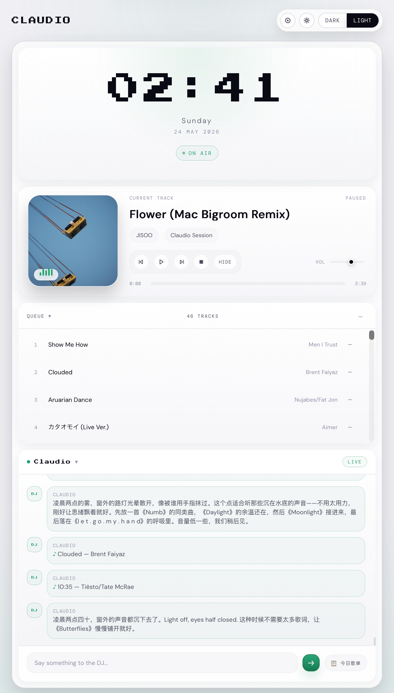
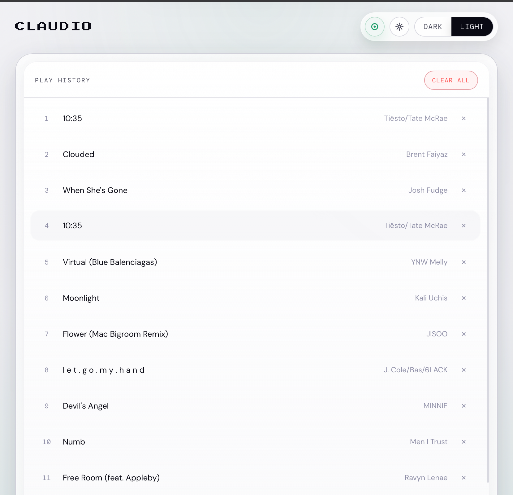
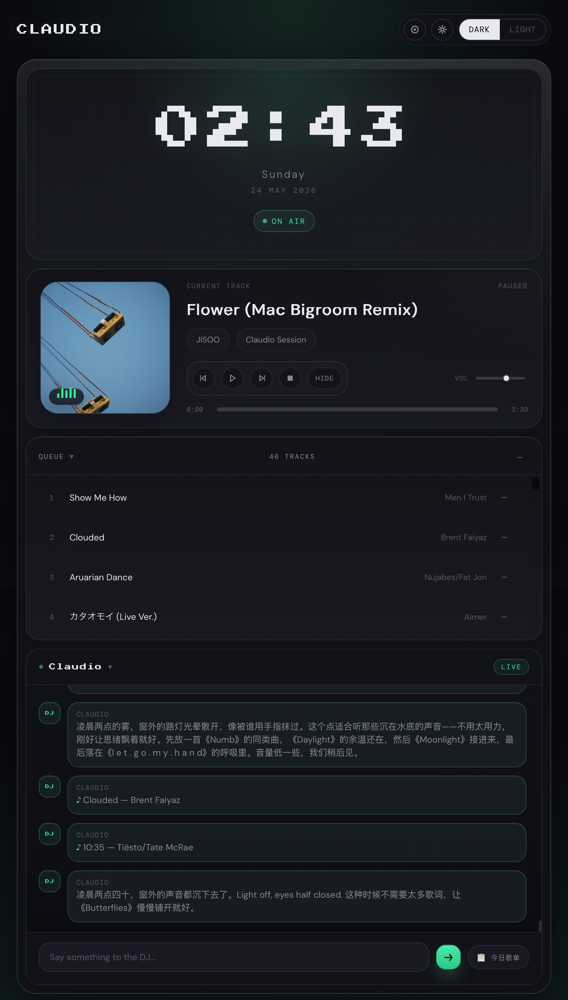
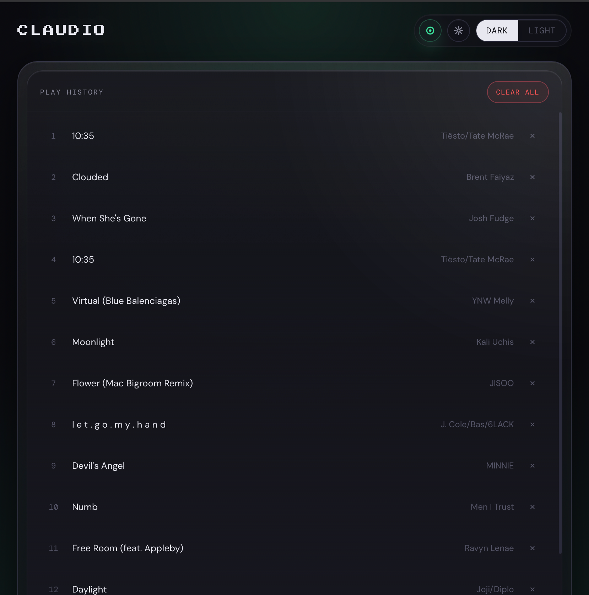

# Claudio — 私人 AI 电台

你的私人 AI 电台 DJ。Claudio 会根据你的音乐口味、作息规律和当前环境（天气、日历），由 AI 自动选歌并生成播报词，再通过 TTS 合成语音，最终在浏览器或 Naim 音箱上播放。









---

## 目录

- [准备工作（一次性）](#准备工作一次性)
  - [1. 安装基础环境](#1-安装基础环境)
  - [2. 获取 API 密钥](#2-获取-api-密钥)
  - [3. 填写 .env](#3-填写-env)
  - [4. 启动网易云音乐 API](#4-启动网易云音乐-api)
  - [5. 登录网易云](#5-登录网易云)
  - [6. 授权 Google Calendar（可选）](#6-授权-google-calendar可选)
  - [7. 定制你的电台](#7-定制你的电台)
  - [8. 可选：配置 Naim 音箱推流](#8-可选配置-naim-音箱推流)
- [日常使用](#日常使用)
  - [启动服务](#启动服务)
  - [使用前端](#使用前端)
  - [自动调度说明](#自动调度说明)
- [常见问题](#常见问题)
- [API 参考](#api-参考)

---

## 准备工作（一次性）

### 1. 安装基础环境

你需要在电脑上安装以下软件：

| 软件 | 用途 | 安装方式 |
|------|------|----------|
| **Node.js** (≥22) | 运行服务端 | [nodejs.org](https://nodejs.org) 下载 LTS 版 |
| **pnpm** | 包管理器 | `npm install -g pnpm` |
| **Python** (≥3.10) | Edge TTS 语音合成 | `winget install Python.Python.3.12` 或 [python.org](https://python.org) |
| — | 运行网易云音乐 API | 不需要额外安装，用 `npx` 一键启动（见步骤 4） |

安装完成后，在项目目录执行：

```powershell
# 安装 Node.js 依赖
pnpm install

# 安装 Python 依赖
pip install edge-tts
```

> **Windows 注意：** 如果 `pnpm install` 报错 `better-sqlite3` 编译失败，需要先安装 Visual Studio Build Tools：
> ```powershell
> winget install Microsoft.VisualStudio.2022.BuildTools --add Microsoft.VisualStudio.Component.VC.Tools.x86.x64
> ```

验证安装：

```powershell
node --version   # 应显示 v22 或更高
pnpm --version   # 应显示 10.x 或更高
python --version # 应显示 3.10 或更高
npx --version    # 应显示 npm/npx 版本
```

---

### 2. 获取 API 密钥

Claudio 依赖以下外部服务。按需申请密钥（标 \* 的是必填）：

#### 2a. LLM API（必填 \*）

Claudio 的大脑，使用兼容 OpenAI 接口格式的大语言模型。支持 **DeepSeek**、**OpenAI**、**通义千问**、**本地 ollama** 等。

以 DeepSeek 为例：
1. 前往 [DeepSeek 开放平台](https://platform.deepseek.com) 注册/登录
2. 在「API Keys」页面创建一个 Key，复制 **API Key**
3. （可选）如果想用其他模型，修改 `.env` 中的 `LLM_BASE_URL`、`LLM_MODEL`

> 常见模型配置见下方步骤 3。

#### 2b. 和风天气（必填 \*）

用于获取实时天气，影响选曲策略。

1. 前往 [和风天气控制台](https://console.qweather.com) 注册/登录
2. 进入「项目管理」，创建一个项目（免费订阅即可，每天 1000 次调用）
3. 复制 **API Key**
4. 如果你的城市不是北京，在 [城市查询](https://github.com/qwd/LocationList) 找到你的 **Location ID**

#### 2c. Fish Audio（可选）

TTS 备选引擎，音质比 Edge TTS 更好。

1. 前往 [Fish Audio](https://fish.audio) 注册/登录
2. 进入控制台获取 **API Key**
3. 在声音库中选择一个中文声音，复制其 **Reference ID**（即模型页 URL `https://fish.audio/m/<model_id>` 中的 `<model_id>` 部分）
4. 可选：设置模型，如 `FISH_MODEL=s2-pro`

> 如果不需要 Fish Audio，只用免费的 Edge TTS 即可，不填此项不会影响使用。如果网络不通或余额不足，`TTS_ENGINE=auto` 模式下会自动回退到 Edge TTS。

#### 2d. Google Calendar（可选）

让 Claudio 知道你的日程，早报会播报今日安排。

1. 前往 [Google Cloud Console](https://console.cloud.google.com)
2. 新建项目 → 启用 **Google Calendar API**
3. 创建 OAuth 2.0 凭据 → 选择「桌面应用」类型
4. 下载凭据 JSON 文件，重命名为 `credentials.json`，放到项目根目录
5. 运行授权脚本（见步骤 6）

> 不需要日历功能可跳过此项。

#### 2e. 飞书 Webhook（可选）

通过飞书机器人推送每日早报。

1. 打开飞书 → 创建一个群 → 群设置 → 机器人 → 添加「自定义 Webhook 机器人」
2. 复制 **Webhook URL**

> 不需要飞书推送可跳过此项。

---

### 3. 填写 .env

打开项目根目录下的 `.env` 文件，填入上一步获取的密钥：

```env
# ---- 必填：LLM ----
LLM_BASE_URL=https://api.deepseek.com
LLM_API_KEY=你的 LLM API Key
LLM_MODEL=deepseek-chat
LLM_JSON_MODE=true

# ---- 必填：天气 ----
QWEATHER_KEY=你的和风天气 API Key
QWEATHER_HOST=你的和风天气 API Host
QWEATHER_LOCATION=101010100

# ---- 网易云（脚本自动填入，不需要手动改）----
NCM_BASE=http://localhost:3000
NCM_COOKIE=

# ---- TTS 语音合成引擎 ----
TTS_ENGINE=auto          # edge | fish | auto（推荐）

# ---- 可选：Fish Audio 更好听的 TTS ----
FISH_API_KEY=
FISH_REFERENCE_ID=       # voice model ID（原 FISH_VOICE_ID）
FISH_MODEL=s2-pro

# ---- 可选：Google Calendar ----
GOOGLE_CREDENTIALS_PATH=./credentials.json

# ---- 可选：飞书早报推送 ----
LARK_WEBHOOK=

# ---- 服务端口 ----
PORT=8080

# ---- SQLite 历史记录上限（默认歌曲 2500 首、消息1000条，可设置参数进行覆盖） ----
STATE_MAX_PLAYS=2500
STATE_MAX_MESSAGES=1000

# ---- 页面启动时回填的历史展示上限（默认歌曲 100 首、消息50条，可设置参数进行覆盖） ----
UI_HISTORY_PLAY_LIMIT=100
UI_HISTORY_MESSAGE_LIMIT=50
```

**最少配置：** 需要填 `LLM_API_KEY` + `QWEATHER_KEY`，其余留空即可跑通核心链路。

**切换 LLM 提供商示例：**

| 提供商 | LLM_BASE_URL | LLM_MODEL |
|--------|-------------|-----------|
| DeepSeek | `https://api.deepseek.com` | `deepseek-chat` |
| OpenAI | `https://api.openai.com/v1` | `gpt-4o` |
| 通义千问 | `https://dashscope.aliyuncs.com/compatible-mode/v1` | `qwen-plus` |
| ollama 本地 | `http://localhost:11434/v1` | `llama3`（需 `LLM_JSON_MODE=false`） |

---

### 4. 启动网易云音乐 API

Claudio 通过 NeteaseCloudMusicApi 搜索和获取歌曲。

```powershell
npx NeteaseCloudMusicApi
```

启动后默认监听 `http://localhost:3000`。保持这个终端开着，在另一个终端操作 Claudio。

验证是否启动成功：

```powershell
curl http://localhost:3000/search?keywords=晴天
```

如果返回 JSON 数据说明正常。以后每次使用前需要先启动该服务。

---

### 5. 登录网易云

不登录也能搜索歌曲，但登录后可以获得更高品质的音频直链。

```powershell
node scripts/ncm-login.js
```

脚本会：
1. 生成一个二维码图片 `qr.png` 在项目根目录
2. 打开 `qr.png`，用**网易云音乐 App** 扫码
3. 在手机上确认登录
4. 终端提示「登录成功」，cookie 自动写入 `.env`

> 如果扫码不成功，重新运行脚本即可。Cookie 过期后（通常几周到几个月）需要重新登录。

---

### 6. 授权 Google Calendar（可选）

前提：已按步骤 2c 获取 `credentials.json` 并放在项目根目录。

```powershell
node scripts/setup-gcal.js
```

脚本会：
1. 打印一个授权 URL
2. 用**浏览器**打开该 URL，登录你的 Google 账号
3. 授权后页面会显示一个 code
4. 把 code 粘贴回终端，按回车
5. 授权成功，自动拉取今天日历作为验证

> 授权凭据保存在 `token.json`，有效期很长，无需重复授权。如果过期，再次运行此脚本即可。

---

### 7. 定制你的电台

这是**最重要的一步**——Claudio 的播报质量完全取决于你写了什么。

编辑 `user/` 目录下的 2 个文件：

#### taste.md — 音乐口味

```markdown
# 音乐口味

## 偏好风格
indie folk、城市流行、日系氛围音乐、后摇

## 喜欢的歌手
林忆莲、Coldplay、坂本龙一、草东没有派对

## 时段偏好
- 早晨：轻快、有活力但不太吵
- 工作中：无人声，后摇或电子氛围
- 傍晚：放松、city pop
- 睡前：极简钢琴、环境音

## 不喜欢的
重金属、喊麦、抖音热歌
```

#### playlists.json — 歌单

如果网易云有收藏歌单，填入歌单 ID：

```json
{
  "uid": "你的网易云UID",
  "playlists": [
    { "id": "123456", "name": "我的喜欢" },
    { "id": "987654", "name": "工作时听" }
  ]
}
```

---

### 8. 可选：配置 Naim 音箱推流

如果你有 Naim / Mu-so 系列音箱（需在同一局域网）：

1. 确保音箱已连网
2. 启动 Claudio 后，访问 `GET /api/upnp/devices` 查看发现的设备
3. 通过 `POST /api/upnp/play` 推送音频到音箱

> 不需要 Naim 音箱可以用 PWA 前端直接在手机/电脑上播放。

---

## 日常使用

### 启动服务

一条命令同时启动网易云 API 和 Claudio 服务：

```powershell
pnpm start:all
```

（分别用黄色和青色区分两个服务的日志输出）

也可以分开启动：

```powershell
pnpm ncm    # 仅启动网易云 API（端口 3000）
pnpm dev    # 仅启动 Claudio（端口 8080，开发模式自动重启）
```

看到以下输出表示启动成功：

```
Claudio running on http://localhost:8080
[scheduler] Scheduled: 08:55 calendar pre-fetch, 09:00 morning plan, 40-min mood check
```

### 使用前端

1. 手机和电脑在同一局域网
2. 手机浏览器打开 `http://<你的电脑IP>:8080/pwa/`
3. 你会看到一个聊天界面，在底部输入框跟 Claudio 说话

**可以说的例子：**

| 你说 | Claudio 做什么 |
|------|---------------|
| 「来首轻松的歌」 | 直接搜索播放 |
| 「适合下午工作的背景音乐」 | AI 选曲 + 播报词 + TTS |
| 「今天天气怎么样」 | 返回天气信息 |
| 「推荐几首新歌」 | AI 帮你挑歌 |

**前端界面说明：**

- **💬 Chat 标签** — 主界面，和 DJ 对话。输入框右侧的 **📋 今日歌单** 按钮可随时根据当前时间/天气生成一份 10 首推荐歌单
- **🎵 Taste 标签** — 查看你的口味配置
- **📀 RECORD 按钮** — 右上角唱片图标，点击后卡片 3D 翻转到背面，展示最近 200 条播放历史。可单条删除或一键清空，删除会同步清理数据库
- **⚙ Settings 标签** — 连接状态和版本信息
- **顶部迷你播放器** — 显示当前播放，点击播放/暂停

### 自动调度说明

Claudio 启动后会注册以下定时任务（不需要你手动操作）：

| 时间 | 动作 |
|------|------|
| 每天 08:55 | 预拉取今日日历 |
| 每天 09:00 | 早报播报 + 生成今日播单 + 飞书推送 |
| 每40分钟（每小时 0 分和 40 分） | 心情检测，判断是否换风格（跳过 9 点时段，即 09:00 与 09:40） |

补充说明：

- **心情检测** 会按上表的固定时间自动调用 LLM，但当前主要是文字播报，默认不做 TTS 语音播报
- **自动续播** 不属于定时任务。当播放队列进入最后一首时，前端会后台调用 LLM 触发自动补歌，并生成新的播报词和续播歌曲，所以体感上可能比“每40分钟一次”更频繁

---

## 常见问题

| 问题 | 解决方案 |
|------|---------|
| `better-sqlite3` 安装报错 | `winget install Microsoft.VisualStudio.2022.BuildTools --add Microsoft.VisualStudio.Component.VC.Tools.x86.x64` |
| `edge-tts` 找不到命令 | 用 `python -m edge_tts` 替代，或 `pip install edge-tts` 后重启终端 |
| LLM API 调用失败 | 检查 `.env` 中 `LLM_API_KEY` 是否正确，`LLM_BASE_URL` 是否拼写正确 |
| LLM 不返回 JSON | 尝试设置 `LLM_JSON_MODE=false`，部分模型不支持 JSON 模式 |
| 网易云 API 连不上 | 确认 `npx NeteaseCloudMusicApi` 在另一个终端运行且监听 `http://localhost:3000` |
| NCM 歌曲链接 403 | cookie 过期，重新运行 `node scripts/ncm-login.js` |
| 天气获取失败 `HTTP 403` | 检查 `.env` 中 `QWEATHER_KEY` 和 `QWEATHER_HOST` 是否正确（2026年起和风需要专属 API Host，在[控制台设置](https://console.qweather.com/setting)查看） |
| UPnP 找不到 Naim | 确认 Naim 和电脑在同一局域网，关闭 Windows 防火墙后重试 |
| Google Calendar 授权失败 | `credentials.json` 必须选择「桌面应用」OAuth 类型，不能是 Web 应用 |
| 端口 8080 被占用 | 修改 `.env` 中 `PORT=` 为其他端口如 `8081` |

---

## 更新说明

- [v1.3 更新说明](doc/更新说明1.3.md) — 今日歌单按钮、Session 按天持久化、QUEUE 交互优化、折叠展开、调度器精简、天气域名修复
- [v1.2 更新说明](doc/更新说明1.2.md) — TTS 引擎切换、RECORD 翻转卡片、自动续播、心情检测优化
- [v1.1 更新说明](doc/更新说明1.1.md) — 历史回填、SQLite 限量清理、`.env.example` 模板

---

## API 参考

### HTTP 端点

| 方法 | 路径 | 说明 |
|------|------|------|
| `GET` | `/api/health` | 健康检查，返回 `{"status":"ok","uptime":...}` |
| `POST` | `/api/chat` | 发送消息 `{"message":"..."}` → 返回 `{"ok":true,"say":"...","play":[...],...}` |
| `GET` | `/api/now` | 当前播放的歌曲 |
| `GET` | `/api/next` | 今日播单下一首 |
| `GET` | `/api/taste` | 用户口味文件内容 |
| `GET` | `/api/plan/today` | 今日 AI 生成的播单计划 |
| `POST` | `/api/plan/today` | 手动生成今日歌单（10首）— 根据当前天气和日历实时生成并推送到队列 |
| `GET` | `/api/history` | 最近历史（聊天记录 + 播放记录） |
| `GET` | `/api/plays?limit=N&offset=M` | 分页查询播放记录，返回 `{total, rows}` |
| `DELETE` | `/api/play/:id` | 删除指定播放记录（通过 dbId） |
| `GET` | `/api/song/:id/url` | 按网易云歌曲 ID 获取/刷新播放链接 |
| `GET` | `/api/song/:id/meta` | 按网易云歌曲 ID 获取专辑名和封面 |
| `POST` | `/api/refill` | 自动续播：当播放进入最后一首时后台请求新歌，并追加新的播报与队列 |
| `POST` | `/api/tts/:id/complete` | 前端播报结束/失败后回执，服务端进入 TTS 临时文件延迟删除窗口 |
| `GET` | `/api/upnp/devices` | 局域网 UPnP 设备列表 |
| `POST` | `/api/upnp/play` | 推送到 UPnP 设备 `{"url":"...","deviceName":"..."}` |

### WebSocket 事件 (`/stream`)

| 事件 | 方向 | 数据结构 |
|------|------|---------|
| `connected` | 服务器→客户端 | `{"version":"0.1.0"}` |
| `say` | 服务器→客户端 | `{"text":"播报词","audio":"/tts/xxx.mp3","ttsId":"唯一播报ID","autoStartMusic":true}` |
| `now-playing` | 服务器→客户端 | `{"name":"歌名","artist":"歌手","album":"专辑名","cover":"封面URL","url":"...","id":"...","dbId":123}` |
| `segue` | 服务器→客户端 | `{"text":"衔接词"}` |
| `error` | 服务器→客户端 | `{"text":"错误信息"}` |

---

## 技术栈

Node.js · Express 5 · WebSocket (ws) · SQLite (better-sqlite3) · NeteaseCloudMusicApi · Edge TTS · Fish Audio · Google Calendar API · 和风天气 API · 飞书 Webhook · UPnP (node-ssdp)

---

## 分享给朋友

项目本体不到 200KB，但 `node_modules/` 有近 300MB。打包时自动排除依赖、缓存和密钥：

```powershell
pnpm pack:zip
```

会生成 `claudio.zip`，发给朋友即可。

朋友收到后：

```powershell
# 1. 解压 zip
# 2. 进入目录，安装依赖
pnpm install

# 3. 编辑 .env，填写自己的密钥（至少 LLM_API_KEY + QWEATHER_KEY）

# 4. 启动
pnpm start:all
```
